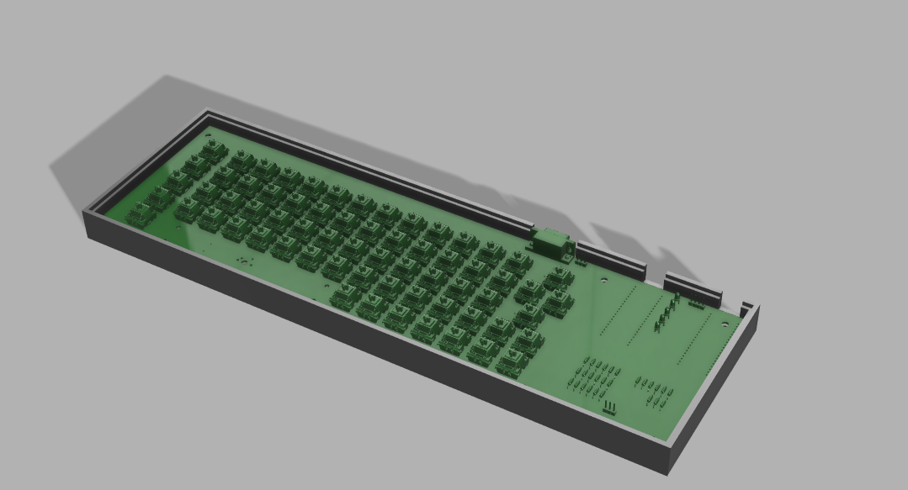
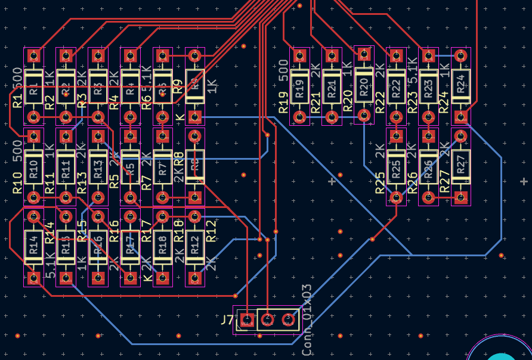
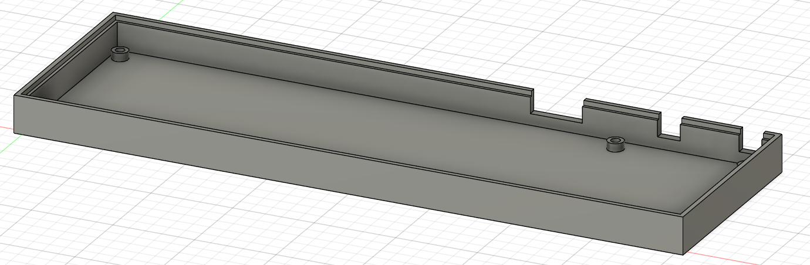
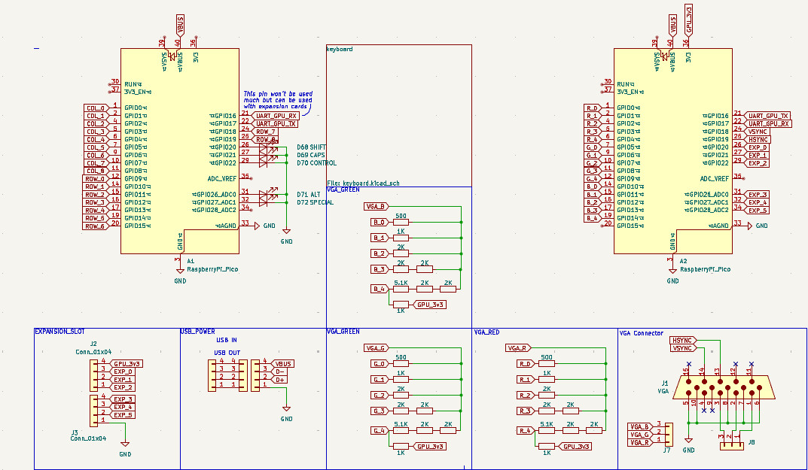
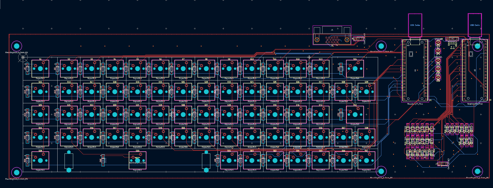

# zepto_duo_terminal
An old school-style VGA output terminal PC!
The PC is powered by two Raspberry Pi Picos. One of the Pico handles the main processing and the keyboard matrix (CPU Pico) and the other Pico handles the VGA Output and the conversion between text to pixels (GPU Pico). The Picos can be replaced with any Pin-compatible version.

## VGA DAC
The GPU Pico is connected to a Resistor DAC that outputs VGA compatible voltage values. There are 5 bits of resolution for each colour channel (RGB555), which allows for 32K colours. The values for the DAC are as 500, 1K, 2K, and 5.1K (commonly used values).

## Keyboard Matrix 
The Keyboard matrix is composed of 8 Rows and 8 Columns, following an ortholinear keyboard layout. Sticky (toggle) keys is also enabled by default to make using the keyboard easier. The keyboard features a "Special" key instead of the commly used Fn or GUI keys. The keycaps are all custom becuase of their specific use case and the unorthodox ortholinear layout.

# Pictures

# BOM
|Item                  |Cost|
|----------------------|----|
|DB-15 VGA Connector   |[1](https://roboticsdna.in/product/db15-female-pcb-mount-right-angle-connector-2-pcs/)   |
|1N4148 Diodes         |[5](https://roboticsdna.in/product/diode-1n4148/)   |
|LEDs                  |[0.5](https://roboticsdna.in/product/super-bright-white-led-3mm-1000-pcs/) |
|Raspberry Pi Pico (x2)|[10](https://roboticsdna.in/product/raspberry-pi-pico/)  |
|Headers               |[0.5](https://roboticsdna.in/product/40x1-10mm-2-5mm-pitch-burg-strip-male-straight-brass-high-quality-pack-of-5/) |
|PCB (400x120mm)       |[75](https://www.pcbpower.com/page/pcb-fabrication)  |
|Case + Keycaps        |    |
|Switches              |[20](https://stackskb.com/store/akko-v3-cream-blue-pro-switch-pack-of-45/)  |
|TOTAL                 |112 |
